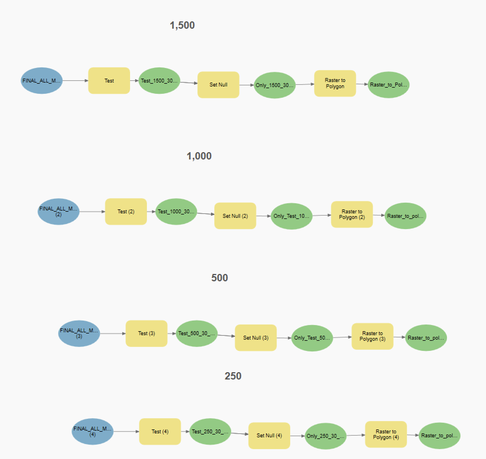

# Geographic Shapefiles Preprocessing: ArcGIS model

The ArcGIS (3.1.1 version) model was developed to process dengue epidemiological data and estimate administrative level 2 incidence cases.

The methods implemented in this model took various data sources and combined them with geospatial features of area boundaries and population density to estimate population size, target area and dengue burden in the administrative 2 level unit level. The main data sources are:

1. Relevant geographies list: Complete list of countries with registered dengue incidence in IHME by 2012
2. Admin 2 2011 shapefiles: Boundaries to all countries included in the tool.
3. [World population count](https://hub.worldpop.org/geodata/summary?id=24777)
4. [Population density](https://hub.worldpop.org/geodata/listing?id=77): dataset for each country in subgroups with all population counts
5. Dengue incidence: (5 x 5km globally) from the Bhatt et al. paper
6. 12.5 Disease Reduction Targeting Criteria: Data extracted from models to inform target product profile.
7. 25 Disease Reduction Targeting Criteria: Data extracted from models to inform target product profile.

## Development Notes

Targeting criteria is defined by population density and disease reduction target. Different datafiles created in ArcGIS (3.1.1 version). All the different databases (.shp files) created that are searched by the react tool are created following the next steps

### ArcGIS model:

0. Merging population density files per country.
1. Develop target areas based on population density: Testing for population density threshold to identify areas.
2. Estimating the total areas by relevant admin 2 areas: This step is done for both targeting criteria options.
3. Estimating the total and target population by admin 2 area.
4. Estimating dengue incidence and burden by admin 2 area.
   Model can be found in GitHub Repository.

### Population density estimates

Initial filtering to get all relevant geographies and merged to shape files, and population counts. For population density it was done separately for each country through subgroups and a final merge; the result is individual country raster in one single layer with all population counts. Model was created for each of the population density criteria using following model; the only difference with other population density variable to specify wanted areas.

### Area estimates:

Area estimates are calculated at the administrative level 2 area; the variable name is Areasqkm meaning area in square kilometers. To calculate target area in square kilometers the variable name is Areatsqkm. This parameter is used to calculate cost inputs, we calculate by locating targeting areas at the desired population density. Similarly, to target are we create estimates for total population by administrative 2 level relying on population count data set. Dengue estimates are going to be closely related to population count. As the spatial specificity of the global dengue incidence dataset is larger (5 km x 5 km) than many of the target areas, calculate the dengue incidence on an administrative 2 level. This follows a similar process to the ‘total area’ and ‘total population count’ on an administrative level 2 above. All these rasters with information varying by population density for total population and incidence are merged into one file.

### Disease Reduction

Joining dengue estimates and merging with table with dengue incidence for calculation consistency. Results indicate that there are 1273 administrative areas in the 12.5% reduction and 3493 administrative areas in the 25% reduction. Calculate dengue incidence and rename columns for consistency.
